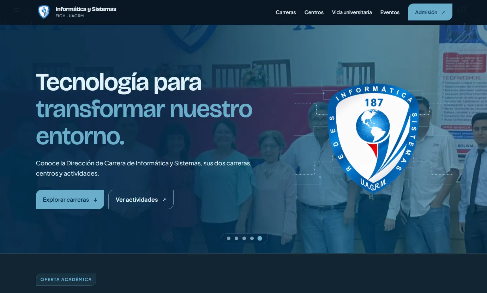

<a id="readme-top"></a>

<div align="center">



### Sitio institucional de la Dirección de Carrera

Ingeniería Informática e Ingeniería en Sistemas · FICH · UAGRM.

![Astro][astro-shield]
![TypeScript][typescript-shield]
![Tailwind CSS][tailwind-shield]
![simple-icons][icons-shield]

</div>

## Tabla de contenidos

- [Sobre el proyecto](#sobre-el-proyecto)
- [Información institucional](#información-institucional)
- [Oferta académica](#oferta-académica)
- [Características](#características)
- [Stack](#stack)
- [Arquitectura](#arquitectura)
- [Estructura del contenido](#estructura-del-contenido)
- [Recursos visuales](#recursos-visuales)
- [SEO y accesibilidad](#seo-y-accesibilidad)
- [Instalación](#instalación)
- [Desarrollo](#desarrollo)
- [Producción](#producción)
- [Contenido y personalización](#contenido-y-personalización)
- [Contacto](#contacto)
- [Licencia](#licencia)

## Sobre el proyecto

Sitio institucional de la Dirección de Carrera de Informática y Sistemas. Presenta la oferta académica, los espacios de práctica, las actividades y la información de admisión de Ingeniería Informática e Ingeniería en Sistemas, en el marco de la FICH · UAGRM.

El sitio se genera como una aplicación estática con contenido tipado en módulos de TypeScript y publicación optimizada para la web.

## Información institucional

- **Dirección:** Dirección de Carrera de Informática y Sistemas.
- **Dependencia académica:** Facultad Integral del Chaco · Universidad Autónoma Gabriel René Moreno.
- **Ubicación:** Av. Humberto Suárez Roca, Camiri, Bolivia.
- **Sitio oficial:** <https://www.infosist.org/>.
- **Correo:** <c_informatica.fich@uagrm.edu.bo>.
- **WhatsApp:** [Consultar por WhatsApp](https://wa.me/59176660753).
- **TikTok:** <https://www.tiktok.com/@infosis.uagrm.fich>.
- **Repositorio:** <https://github.com/infosis-fich/infosis-landing>.

## Oferta académica

La landing presenta dos carreras oficiales:

- [Ingeniería Informática](/carreras/informatica): software, inteligencia artificial, datos, redes, ciberseguridad e innovación tecnológica.
- [Ingeniería en Sistemas](/carreras/sistemas): software, datos, redes, gestión tecnológica y soluciones para organizaciones.

Cada ficha incluye:

- Resumen de la carrera.
- Áreas de formación.
- Proyección profesional.
- Malla curricular por semestres.
- Acceso al PDF oficial de la malla.
- Modalidades de titulación.

## Características

- Hero institucional con carrusel automático cada seis segundos.
- Carruseles independientes en las fichas de carrera.
- Flechas laterales e indicadores circulares.
- Fichas diferenciadas para ambas carreras.
- Malla curricular organizada en dos columnas.
- Apertura y cierre sincronizados por pares de semestres.
- Proyección profesional para ambas carreras.
- Tarjetas de centros y laboratorios.
- Contacto de responsables mediante WhatsApp.
- Eventos con visor de afiches a pantalla completa.
- Galería institucional organizada en cuatro grupos:
  - Comunidad universitaria.
  - Formación y capacitación.
  - Laboratorio de cómputo.
  - Hardware y redes.
- Visor de imágenes reutilizable y aislado por contexto.
- Imágenes optimizadas y cargadas de forma diferida.
- Diseño responsive y modo oscuro permanente.
- Navegación por teclado y soporte para movimiento reducido.
- SEO técnico, Open Graph, Twitter Cards, sitemap y `robots.txt`.

## Stack

| Componente | Tecnología |
| --- | --- |
| Framework | Astro 7 |
| Renderizado | Static output |
| Lenguaje | TypeScript |
| Estilos | Tailwind CSS 4 |
| Integración CSS | `@tailwindcss/vite` |
| Iconos de marcas | `simple-icons` |
| SEO | `@astrojs/sitemap` |
| Imágenes | WebP y PNG optimizado |
| Package manager | pnpm |
| Node.js | 22.12+ |
| Dominio | `https://www.infosist.org` |

## Arquitectura

```text
Página Astro
  -> Layout y metadata SEO
  -> Barra de navegación
  -> Hero institucional
  -> Carreras
  -> Centros
  -> Más oportunidades
  -> Eventos
  -> Galería institucional
  -> Admisión
  -> Footer y contactos
```

Astro genera las rutas estáticas de la portada y de las fichas de carrera a partir de los datos institucionales del proyecto.

### Orden de la portada

```text
Portada
  -> Oferta académica
  -> Centros y laboratorios
  -> Más oportunidades
  -> Noticias y actividades
  -> Galería institucional
  -> Admisión
```

### Estructura física

```text
src/
├── components/
│   ├── BarraNavegacion.astro
│   ├── CarruselGaleria.astro
│   ├── CarruselHero.astro
│   ├── EncabezadoSeccion.astro
│   ├── FichaCarrera.astro
│   ├── IconoWhatsApp.astro
│   ├── Layout.astro
│   ├── PiePagina.astro
│   ├── TarjetaCentro.astro
│   ├── TarjetaEvento.astro
│   ├── VisorImagenes.astro
│   └── secciones/
│       ├── MallaCurricular.astro
│       ├── Portada.astro
│       ├── SeccionAdmision.astro
│       ├── SeccionCarreras.astro
│       ├── SeccionCentros.astro
│       ├── SeccionEventos.astro
│       ├── SeccionGaleria.astro
│       └── SeccionVidaUniversitaria.astro
├── datos/
│   ├── carreras.ts
│   ├── centros.ts
│   ├── eventos.ts
│   ├── galeria.ts
│   ├── mallas.ts
│   └── titulacion.ts
├── pages/
│   ├── index.astro
│   └── carreras/
│       └── [slug].astro
└── styles/
    └── global.css
docs/
└── base.md
astro.config.mjs
package.json
pnpm-lock.yaml
```

## Estructura del contenido

Los datos editables se encuentran en `src/datos/`:

- `carreras.ts`: información, imágenes hero y proyección profesional.
- `centros.ts`: laboratorios, logos, descripciones y responsables.
- `eventos.ts`: afiches, fechas y descripciones.
- `galeria.ts`: imágenes institucionales agrupadas por contexto.
- `mallas.ts`: materias organizadas por semestre.
- `titulacion.ts`: modalidades de titulación.

La base editorial y las decisiones institucionales se documentan en `docs/base.md`.

Las rutas disponibles son:

```text
/
/carreras/informatica
/carreras/sistemas
```

## Recursos visuales

```text
public/
├── documentos/
│   ├── malla-ingenieria-informatica.pdf
│   └── malla-ingenieria-sistemas.pdf
├── eventos/
├── general/
├── lab-capacitacion/
├── lab-computo/
├── lab-hardware/
├── centro-capacitacion.png
├── centro-computo.png
├── centro-hardware.png
├── escudo-infosis.png
├── portada.webp
├── patrones/
└── robots.txt
```

Las fotografías se sirven en WebP con nombres normalizados por contexto. El escudo y los logos conservan PNG para mantener la transparencia. Las imágenes de galerías y tarjetas utilizan `loading="lazy"` y `decoding="async"`; las imágenes de los heroes se cargan como parte de la presentación inicial.

## SEO y accesibilidad

El layout central administra:

- Títulos y descripciones específicas por ruta.
- Canonical absoluto sobre `https://www.infosist.org`.
- Open Graph y Twitter Cards.
- Localización `es_BO`.
- Datos estructurados para la organización educativa y el sitio.
- Favicon y color de tema.
- Sitemap generado por `@astrojs/sitemap`.
- `robots.txt`.

La interfaz también incluye:

- `alt` y `aria-label` en imágenes y controles.
- Navegación por teclado.
- Foco visible.
- Semántica de encabezados y landmarks.
- Soporte para `prefers-reduced-motion`.

## Instalación

```bash
corepack enable
pnpm install
pnpm dev
```

La aplicación queda disponible en `http://localhost:4321`.

## Desarrollo

```bash
pnpm dev      # Servidor de desarrollo
pnpm check    # Validación de Astro y TypeScript
pnpm build    # Compilación estática de producción
pnpm preview  # Vista previa de la compilación
```

## Producción

```bash
pnpm build
```

El resultado se genera en `dist/` y puede desplegarse como sitio estático en cualquier servicio compatible con archivos estáticos.

## Contenido y personalización

Para actualizar el contenido:

1. Edita los módulos correspondientes dentro de `src/datos/`.
2. Mantén las imágenes en la carpeta temática adecuada dentro de `public/`.
3. Usa nombres normalizados y formatos WebP para fotografías.
4. Conserva textos alternativos descriptivos.
5. Ejecuta `pnpm check` y `pnpm build` antes de publicar.

La paleta, tipografías, botones, fondos y utilidades visuales se encuentran en `src/styles/global.css`.

## Contacto

- WhatsApp: [Consultar por WhatsApp](https://wa.me/59176660753).
- Correo: <c_informatica.fich@uagrm.edu.bo>.
- TikTok: <https://www.tiktok.com/@infosis.uagrm.fich>.
- Código fuente: <https://github.com/infosis-fich/infosis-landing>.

## Licencia

El código de este proyecto se distribuye bajo la licencia [MIT](./LICENSE).

La licencia permite usar, copiar, modificar y redistribuir el código, siempre que se conserve el aviso de copyright y el texto de la licencia.

Los logotipos institucionales, marcas, fotografías y documentos académicos conservan sus respectivas condiciones de uso.

<p align="right">(<a href="#readme-top">volver arriba</a>)</p>

[astro-shield]: https://img.shields.io/badge/Astro-7-BC52EE?style=for-the-badge&logo=astro&logoColor=white
[typescript-shield]: https://img.shields.io/badge/TypeScript-5-3178C6?style=for-the-badge&logo=typescript&logoColor=white
[tailwind-shield]: https://img.shields.io/badge/Tailwind_CSS-4-06B6D4?style=for-the-badge&logo=tailwindcss&logoColor=white
[icons-shield]: https://img.shields.io/badge/simple--icons-16-111111?style=for-the-badge&logo=simpleicons&logoColor=white
